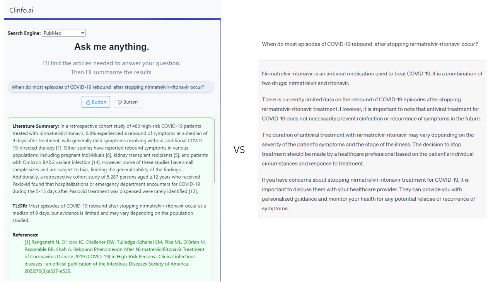
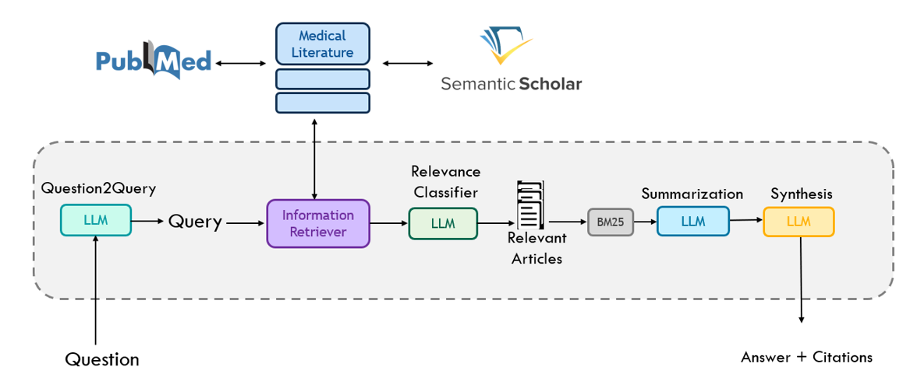

To run backend server:
```shell
uvicorn app:app --reload --host 0.0.0.0 --port 8001 --log-config=log_conf.yaml --use-colors
```
 
 
 
 Welcome to the official repository  for **Clinfo.ai**: An Open-Source Retrieval-Augmented Large Language Model System for Answering Medical Questions using Scientific Literature.

<p align="center">
  <strong>Arxiv:</strong> <a href="https://arxiv.org/abs/2310.16146" target="_blank">Arxiv</a> 
  &nbsp;&nbsp;&nbsp;&nbsp;|&nbsp;&nbsp;&nbsp;&nbsp;
  <strong>Paper:</strong> <a href="https://www.worldscientific.com/doi/abs/10.1142/9789811286421_0002" target="_blank">PSB 2024</a> 
  &nbsp;&nbsp;&nbsp;&nbsp;|&nbsp;&nbsp;&nbsp;&nbsp;
  <strong>Demo:</strong> <a href="https://clinfo-demo.herokuapp.com/login" target="_blank">Live App</a>
</p>


If you would like to see some functionality or have a comment, open an issue on this repo, we will try to reply as soon as possible

# 📖 Table of Contents
1. [Intro](#intro)
2. [Clinfo+Closed Source Models](#models_c)
3. [Clinfo+Open Source Models](#models_o)
6. [Citation](#citation)

# Updates
```Jul 05, 2024 Update```: Added Support for Google's API models
#

<a name="intro"/>

Millions of medical research articles are published every year. On the other side, healthcare professionals and medical researchers are expected to stay abreast of the latest scientific discoveries pertinent to their daily practice. However, with limited time and a broad field to cover, keeping up-to-date can be a challenging task. Clinfo.AI **searches** and **synthesizes** medical literature tailored to a **specific** clinical **question** to provide an **answer** grounded on indexed literature. By leveraging a **chain of LLMS** clinfo.ai, can analyze the context of the inquiry to identify and present the most relevant articles pertinent to a scientific question.

## Clinfo.AI vs ChatGPT:



## What type of questions can I ask? 
Questions based on scientific evidence reported in the literature, for example:

1. What percentage of HIV-positive patients transmit the virus to their children?

2. When do most episodes of COVID-19 rebound after stopping paxlovid treatment?

3. Does magnesium consumption significantly improve sleep quality?


## Type of questions you can’t answer with clinfo.AI
 **Broad questions:** These types of questions could potentially be answered by clinfo.AI, but it is highly probable you won’t get what you are looking for. How to correct this type of question? Provide context. For example: "Chest pain pediatrics?"

We recommend asking a specific question to get the best answer:

Original Question: "Chest pain pediatrics?"

Improved Question: "What are common causes of chest pain in pediatric patients?"

<br>


## How does Clinfo.AI work?



Clinfo.AI is a RetA LLM system, it consists of a collection of four LLMs working conjointly (an LLM chain) coupled to a Search Index as depicted in the above Figure: 

1. First, the input (the question submitted by the user) is converted to a query by an LLM (Question2Query). E.g. for PubMed, the question is converted to a query containing MeSH terms.
2. The generated queries are then used to retrieve articles from indexed sources (e.g. PubMed)
3. Then give an article and the original question an LLM is tasked to classify if the article is relevant (if enabled BM25 is used to rank the selected articles).
4. Relevant articles are individually summarized by an LLM.
5. Lasyty an LLM aggregates all summaries to provide an overview of all relevant articles.

   
<a name="models_c"/>

## How can leverage Clinfo.ai using OpenAI models?

#### OPENAI API:
Create an [OpenAI](https://openai.com/index/openai-api/) account, get an API Key, and edit the key field `OPENAI_API_KEY` in `config.py` with your own key. 

#### NCBI API:
Clinfo.ai retrieves literature using the NCBI API; while access does not require an account, calls are limited for unregistered users. We recommend creating an [NCBI](https://www.ncbi.nlm.nih.gov/home/develop/api/) account. Once generated, save the NCBI API key and email under `NCBI_API_KEY` and `EMAIL`, respectively.

In summary edit the following variables inside config.py:
```python
OPENAI_API_KEY = "YOUR API TOKEN"
NCBI_API_KEY   = "YOUR API TOKEN"  (optional)
EMAIL          = "YOUR EMAIL"      (optional)
```

#### Using Clinfo.AI:

```python
from  src.clinfoai.clinfoai import ClinfoAI
from config   import OPENAI_API_KEY, NCBI_API_KEY, EMAIL
os.environ["OPENAI_API_KEY"] = OPENAI_API_KEY

question = "What is the prevalence of COVID-19 in the United States?"
clinfo   = ClinfoAI(llm="gpt-3.5-turbo",openai_key=OPENAI_API_KEY, email= EMAIL)
answer   = clinfo.forward(question=question)         
```


```src/notebooks/01_UsingClinfoAI.ipynb``` has a quick run-through and explanation for  each individaul  clinfo.AI component.

<a name="models_o"/>

## How can leverage Clinfo.ai using Open Source models via VLLM?
Clinfo.ai has full integration with [vLLM](). We can use any open source LLM as a backbone following two simple steps:

## Setting an API server
First, we use vLLM to create an API selecting the model you want to work with:
In the following example we use ```Qwen/Qwen2-beta-7B-Chat```

```bash
 python -m vllm.entrypoints.openai.api_server --model Qwen/Qwen2-beta-7B-Chat
```

### Switch the LLM model name to the selected model 
Instantiate a clinfoAI object with the desired LLM :


```python
from  src.clinfoai.clinfoai import ClinfoAI
os.environ["OPENAI_API_KEY"] = OPENAI_API_KEY

question = "What is the prevalence of COVID-19 in the United States?"
clinfo   = ClinfoAI(llm="Qwen/Qwen2-beta-7B-Chat")
answer   = clinfo.forward(question=question)         
```


### IMPORTANT:
While anyone can use Clinfo.AI, our goal is to augment medical experts not replace them. Read our disclaimer [disclaimer](https://clinfo-demo.herokuapp.com/termsandconditions) and DO NOT use clinfo.AI for medical diagnosis.


<a name="citation"/>

### Cite
If you use Clinfo.ai, please consider citing:

```
@inproceedings{lozano2023clinfo,
  title={Clinfo. ai: An open-source retrieval-augmented large language model system for answering medical questions using scientific literature},
  author={Lozano, Alejandro and Fleming, Scott L and Chiang, Chia-Chun and Shah, Nigam},
  booktitle={PACIFIC SYMPOSIUM ON BIOCOMPUTING 2024},
  pages={8--23},
  year={2023},
  organization={World Scientific}
}
```


